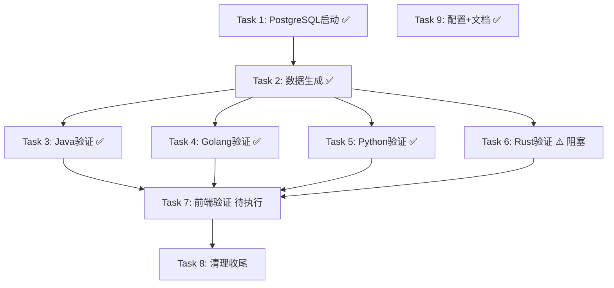

# Tasks

## Phase 1: 数据库环境准备

- [x] Task 1: 启动 PostgreSQL 数据库服务 ✅
  - [x] 1.1 检查 Docker 环境是否可用（Docker Engine v29.3.0 运行正常）
  - [x] 1.2 检查是否有残留容器/卷需要清理（无残留）
  - [x] 1.3 执行 `docker compose up -d postgres` 启动数据库
  - [x] 1.4 等待健康检查通过（healthy 状态）
  - [x] 1.5 验证端口 5432 可访问
  - [x] 1.6 验证 init.sql 已自动执行（orders 表 + 8 个索引已创建）
  - **修复**: postgresql.conf 中 `stats_temp_directory` 在 PG17 中已移除，已注释

## Phase 2: 数据生成验证

- [x] Task 2: 执行数据生成脚本 ✅
  - [x] 2.1 构建 data-generator 镜像（添加 apt-get 重试机制应对网络不稳定）
  - [x] 2.2 在容器中运行数据生成脚本（生成 10000 条测试数据）
  - [x] 2.3 确认数据生成成功（日志显示进度 100%）
  - [x] 2.4 连接数据库验证数据已写入（orders 表 10000 条，状态分布正确）

## Phase 3: 后端服务逐一验证

- [x] Task 3: Java 后端服务验证 (端口 8080) ✅
  - [x] 3.1 构建 Java 服务镜像（Gradle 8.12 + JDK21 完整版，非 alpine）
  - [x] 3.2 启动 Java 服务容器
  - [x] 3.3 等待健康检查通过（/actuator/health → UP）
  - [x] 3.4 验证端口 8080 可访问
  - [x] 3.5 验证 API Key 认证（无 key → 401, 有 key → 正常）
  - [x] 3.6 验证订单查询接口返回 10000 条数据
  - **修复**: JDK21 Record 与 JOOQ 冲突、时间/数值类型转换、ExcelWriter SXSSF API、Cursor 泛型

- [x] Task 4: Golang 后端服务验证 (端口 8081) ✅
  - [x] 4.1 构建 Golang 服务镜像（goproxy.io + GONOSUMCHECK 绕过校验）
  - [x] 4.2 启动 Golang 服务容器
  - [x] 4.3 等待健康检查通过（/health → ok）
  - [x] 4.4 验证端口 8081 可访问
  - [x] 4.5 验证 API Key 认证
  - [x] 4.6 验证订单查询接口返回数据
  - **修复**: Go 代理配置、gin.FormatLog API 变更、未使用导入清理、DB_HOST 环境变量补充

- [x] Task 5: Python 后端服务验证 (端口 8082) ✅
  - [x] 5.1 构建 Python 服务镜像（清华 pip 源 + apt 重试）
  - [x] 5.2 启动 Python 服务容器
  - [x] 5.3 等待健康检查通过（/health → healthy）
  - [x] 5.4 验证端口 8082 可访问
  - [x] 5.5 验证 API Key 认证
  - [x] 5.6 验证订单查询接口返回数据
  - **修复**: Tortoise ORM minsize 参数移除、generate_schemas 注释、gunicorn 端口映射(→8082)、API_KEYS 配置

- [ ] Task 6: Rust 后端服务验证 (端口 8083) ⚠️ 阻塞
  - [x] 6.1 尝试构建 Rust 服务镜像（Rust latest + rsproxy sparse 镜像 + libclang-dev）
  - [ ] 6.2 编译失败：xlsxwriter 0.6.x API 重大变更导致 19 个编译错误
  - **已完成**: Rust 版本升级到最新、Cargo 国内镜像配置、libclang 安装、SERVER_PORT 配置
  - **阻塞原因**: xlsxwriter Format/Worksheet 从 mutable builder 改为全新 API，需重写 excel.rs

## Phase 4: 前端服务验证

- [ ] Task 7: 前端服务验证 (端口 80) 待执行
  - [ ] 7.1 构建前端镜像
  - [ ] 7.2 确保至少一个后端服务正在运行
  - [ ] 7.3 启动前端服务容器
  - [ ] 7.4-7.7 前端功能验证

## Phase 5: 清理收尾

- [ ] Task 8: 清理环境 待执行
  - [ ] 8.1 汇总各服务验证结果
  - [ ] 8.2 关闭所有服务容器

## 额外完成：配置与文档重构

- [x] Task 9: .env 配置迁移 + README 重写 + 模块 README ✅
  - [x] 9.1 .env.example 补充 DB_HOST/PORT/USER/PASSWORD/NAME/SSLMODE/API_KEYS/PORT/SERVER_PORT 等
  - [x] 9.2 docker-compose.yml 精简：所有硬编码值替换为 ${ENV_VAR:-default} 引用
  - [x] 9.3 创建实际 .env 文件
  - [x] 9.4 重写主 README.md（基于最新验证状态）
  - [x] 9.5 创建 6 个模块级 README（java/golang/python/rust/frontend/generate_data）

---

# Task Dependencies

