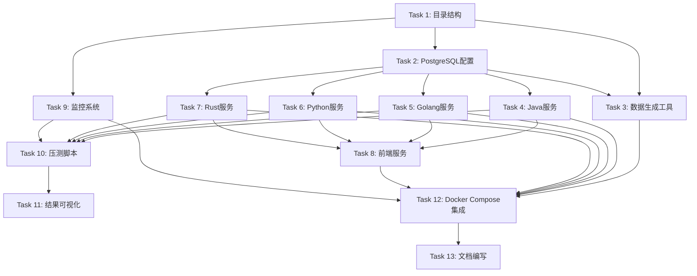

# Tasks

## Phase 1: 基础设施搭建

- [x] Task 1: 创建项目目录结构
  - [x] 1.1 创建 docker-compose.yml 主配置文件
  - [x] 1.2 创建 init/ 目录及子目录
  - [x] 1.3 创建 postgres/ 目录
  - [x] 1.4 创建各语言服务目录 (java/, golang/, python/, rust/)
  - [x] 1.5 创建 frontend/ 目录
  - [x] 1.6 创建 monitor/ 目录
  - [x] 1.7 创建 docs/ 目录

- [x] Task 2: PostgreSQL 数据库配置
  - [x] 2.1 创建 postgres/postgresql.conf 优化配置文件
  - [x] 2.2 创建 postgres/pg_hba.conf 访问控制配置
  - [x] 2.3 编写 init/init.sql 数据库初始化脚本（建表、索引）
  - [x] 2.4 配置 Docker Compose 中的 PostgreSQL 服务

- [x] Task 3: 数据生成工具开发
  - [x] 3.1 创建 init/generate_data/ 目录结构
  - [x] 3.2 实现订单数据生成核心逻辑（符合字段规则）
  - [x] 3.3 实现时间分布逻辑（2020-2024年占比）
  - [x] 3.4 实现状态分布逻辑（待支付15%/已支付50%/已取消15%/已退款5%/已完成15%）
  - [x] 3.5 实现批量数据插入优化（使用 COPY 或批量 INSERT）
  - [x] 3.6 实现增量数据生成功能
  - [x] 3.7 实现数据清理脚本
  - [x] 3.8 编写数据生成工具 Dockerfile

## Phase 2: 后端服务开发

- [x] Task 4: Java 后端服务开发
  - [x] 4.1 创建 java/ 项目结构（Maven/Gradle 配置）
  - [x] 4.2 配置 JDK 25 + Spring Boot 4+ 依赖
  - [x] 4.3 配置 JOOQ 代码生成
  - [x] 4.4 配置 HikariCP 连接池
  - [x] 4.5 实现 API Key 认证中间件
  - [x] 4.6 实现订单查询接口 GET /api/v1/orders
  - [x] 4.7 实现同步导出接口 POST /api/v1/exports/sync
  - [x] 4.8 实现异步导出接口 POST /api/v1/exports/async
  - [x] 4.9 实现任务状态查询接口 GET /api/v1/exports/tasks/{task_id}
  - [x] 4.10 实现 SSE 进度推送 GET /api/v1/exports/sse/{task_id}
  - [x] 4.11 实现文件下载接口 GET /api/v1/exports/download/{token}
  - [x] 4.12 实现流式导出接口 POST /api/v1/exports/stream
  - [x] 4.13 实现 CSV 导出功能
  - [x] 4.14 实现 Excel 导出功能（Apache POI）
  - [x] 4.15 实现异步任务管理（Spring @Async）
  - [x] 4.16 编写 Dockerfile
  - [x] 4.17 配置 Docker Compose 服务

- [x] Task 5: Golang 后端服务开发
  - [x] 5.1 创建 golang/ 项目结构（go mod init）
  - [x] 5.2 配置 Gin + GORM 依赖
  - [x] 5.3 定义数据模型和数据库连接
  - [x] 5.4 配置 GORM 连接池
  - [x] 5.5 实现 API Key 认证中间件
  - [x] 5.6 实现订单查询接口 GET /api/v1/orders
  - [x] 5.7 实现同步导出接口 POST /api/v1/exports/sync
  - [x] 5.8 实现异步导出接口 POST /api/v1/exports/async
  - [x] 5.9 实现任务状态查询接口 GET /api/v1/exports/tasks/{task_id}
  - [x] 5.10 实现 SSE 进度推送 GET /api/v1/exports/sse/{task_id}
  - [x] 5.11 实现文件下载接口 GET /api/v1/exports/download/{token}
  - [x] 5.12 实现流式导出接口 POST /api/v1/exports/stream
  - [x] 5.13 实现 CSV 导出功能
  - [x] 5.14 实现 Excel 导出功能（excelize）
  - [x] 5.15 实现异步任务管理（Goroutine + Channel）
  - [x] 5.16 编写 Dockerfile
  - [x] 5.17 配置 Docker Compose 服务

- [x] Task 6: Python 后端服务开发
  - [x] 6.1 创建 python/ 项目结构
  - [x] 6.2 配置 FastAPI + Tortoise ORM 依赖（requirements.txt）
  - [x] 6.3 定义数据模型（Tortoise ORM Model）
  - [x] 6.4 配置数据库连接池
  - [x] 6.5 实现 API Key 认证中间件
  - [x] 6.6 实现订单查询接口 GET /api/v1/orders
  - [x] 6.7 实现同步导出接口 POST /api/v1/exports/sync
  - [x] 6.8 实现异步导出接口 POST /api/v1/exports/async
  - [x] 6.9 实现任务状态查询接口 GET /api/v1/exports/tasks/{task_id}
  - [x] 6.10 实现 SSE 进度推送 GET /api/v1/exports/sse/{task_id}
  - [x] 6.11 实现文件下载接口 GET /api/v1/exports/download/{token}
  - [x] 6.12 实现流式导出接口 POST /api/v1/exports/stream
  - [x] 6.13 实现 CSV 导出功能
  - [x] 6.14 实现 Excel 导出功能（openpyxl）
  - [x] 6.15 实现异步任务管理（asyncio）
  - [x] 6.16 配置 gunicorn + Uvicorn
  - [x] 6.17 编写 Dockerfile
  - [x] 6.18 配置 Docker Compose 服务

- [x] Task 7: Rust 后端服务开发
  - [x] 7.1 创建 rust/ 项目结构（cargo init）
  - [x] 7.2 配置 Actix-web + Diesel + Tokio 依赖（Cargo.toml）
  - [x] 7.3 定义数据模型（Diesel schema）
  - [x] 7.4 配置数据库连接池
  - [x] 7.5 实现 API Key 认证中间件
  - [x] 7.6 实现订单查询接口 GET /api/v1/orders
  - [x] 7.7 实现同步导出接口 POST /api/v1/exports/sync
  - [x] 7.8 实现异步导出接口 POST /api/v1/exports/async
  - [x] 7.9 实现任务状态查询接口 GET /api/v1/exports/tasks/{task_id}
  - [x] 7.10 实现 SSE 进度推送 GET /api/v1/exports/sse/{task_id}
  - [x] 7.11 实现文件下载接口 GET /api/v1/exports/download/{token}
  - [x] 7.12 实现流式导出接口 POST /api/v1/exports/stream
  - [x] 7.13 实现 CSV 导出功能
  - [x] 7.14 实现 Excel 导出功能（xlsxwriter）
  - [x] 7.15 实现异步任务管理（Tokio）
  - [x] 7.16 编写 Dockerfile
  - [x] 7.17 配置 Docker Compose 服务

## Phase 3: 前端服务开发

- [x] Task 8: Vue.js 前端服务开发
  - [x] 8.1 创建 frontend/ Vue 项目（Vue 3 + Vite）
  - [x] 8.2 配置 Element Plus UI 组件库
  - [x] 8.3 配置 Axios HTTP 客户端
  - [x] 8.4 配置 Pinia 状态管理
  - [x] 8.5 实现 API Key 环境变量配置
  - [x] 8.6 实现请求拦截器（添加 X-API-Key Header）
  - [x] 8.7 实现数据查询页面（筛选条件、分页表格）
  - [x] 8.8 实现同步导出功能
  - [x] 8.9 实现异步导出功能（任务创建、进度展示）
  - [x] 8.10 实现流式导出功能
  - [x] 8.11 实现 SSE 进度实时推送
  - [x] 8.12 实现任务管理页面（任务列表、状态查询）
  - [x] 8.13 实现文件下载功能
  - [x] 8.14 实现后端服务切换功能（Java/Golang/Python/Rust）
  - [x] 8.15 编写 Dockerfile（Nginx 部署）
  - [x] 8.16 配置 Docker Compose 服务

## Phase 4: 监控与测试

- [x] Task 9: 监控系统搭建
  - [x] 9.1 创建 monitor/ 目录结构
  - [x] 9.2 配置 Prometheus 容器监控
  - [x] 9.3 配置 cAdvisor 容器资源监控
  - [x] 9.4 配置 Grafana 可视化面板
  - [x] 9.5 创建自定义监控面板模板
  - [x] 9.6 配置 Docker Compose 监控服务

- [x] Task 10: 性能测试脚本开发
  - [x] 10.1 创建压测脚本目录
  - [x] 10.2 编写 wrk/wrk2 压测脚本（查询接口）
  - [x] 10.3 编写同步导出压测脚本
  - [x] 10.4 编写异步导出压测脚本
  - [x] 10.5 编写流式导出压测脚本
  - [x] 10.6 编写并发测试脚本（单用户/低/中/高并发）
  - [x] 10.7 编写数据量测试脚本（100万-2000万）
  - [x] 10.8 实现测试结果数据采集

- [x] Task 11: 结果可视化
  - [x] 11.1 编写测试结果解析脚本
  - [x] 11.2 实现响应时间图表生成（P50/P90/P95/P99）
  - [x] 11.3 实现吞吐量图表生成（QPS）
  - [x] 11.4 实现资源消耗图表生成
  - [x] 11.5 实现多语言对比图表生成
  - [x] 11.6 生成测试报告模板

## Phase 5: 集成与文档

- [x] Task 12: Docker Compose 集成
  - [x] 12.1 完善 docker-compose.yml 配置
  - [x] 12.2 配置服务依赖关系（depends_on）
  - [x] 12.3 配置网络隔离
  - [x] 12.4 配置数据卷挂载
  - [x] 12.5 配置环境变量文件
  - [x] 12.6 编写一键启动脚本

- [x] Task 13: 文档编写
  - [x] 13.1 编写项目 README.md
  - [x] 13.2 编写部署文档
  - [x] 13.3 编写 API 接口文档
  - [x] 13.4 编写测试指南
  - [x] 13.5 编写性能对比报告模板

---

# Task Dependencies

## 并行执行说明
- **Phase 1**: Task 1 先执行，Task 2 和 Task 3 可部分并行
- **Phase 2**: Task 4、5、6、7 可完全并行开发（四个不同语言服务）
- **Phase 3**: Task 8 依赖后端服务完成
- **Phase 4**: Task 9 可与 Phase 2 并行，Task 10、11 依赖后端服务
- **Phase 5**: Task 12 依赖所有服务完成，Task 13 最后执行
