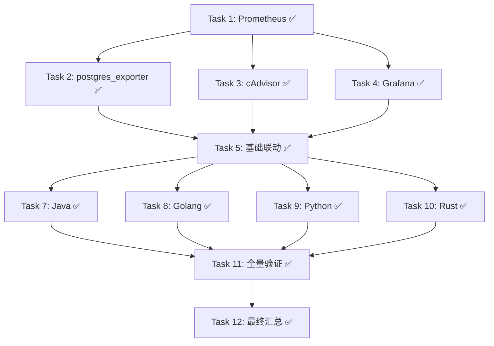

# Tasks

## Phase 1: 核心监控服务启动

- [x] Task 1: 启动 Prometheus 并验证 ✅
- [x] Task 2: 启动 postgres_exporter 并验证 ✅
- [x] Task 3: 启动 cAdvisor 并验证 ✅

## Phase 2: 可视化层验证

- [x] Task 4: 启动 Grafana 并验证 ✅

## Phase 3: 端到端基础联动验证

- [x] Task 5: 监控数据链路端到端验证（PG指标 + 容器指标 + Grafana）✅

## Phase 4: 后端服务逐一启动 + API 调用 + 监控指标验证

- [x] Task 7: Java 后端 — 启动 + 查询接口 + Prometheus 指标验证 ✅
- [x] Task 8: Golang 后端 — 启动 + 查询接口 + Prometheus 指标验证 ✅（修复 /metrics 端点缺失）
- [x] Task 9: Python 后端 — 启动 + 查询接口 + Prometheus 指标验证 ✅（修复 prometheus-fastapi-instrumentator 集成）
- [x] Task 10: Rust 后端 — 启动 + 查询接口 + Prometheus 指标验证 ✅（重建镜像包含 /metrics）

## Phase 5: 全量监控数据汇总与最终验证

- [x] Task 11: 全量 Targets 状态确认 + Grafana 应用面板验证 ✅
  - [x] 11.1 **7/7 targets 全部 up** (prometheus/postgres/cadvisor/java-api/golang-api/python-api/rust-api)
  - [x] 11.2 各后端服务 up=1，PG xact_commit=101,269，容器内存=521MB
  - [x] 11.3 Grafana Benchmark Dashboard 已加载（18 面板）
  - [x] 11.4 各服务关键指标快照已记录

## Phase 6: 清理收尾

- [x] Task 6: 更新文档与清理 ✅（前序版本完成）
- [x] Task 12: 最终汇总 ✅
  - [x] 12.1 更新 tasks.md 标记所有任务完成
  - [x] 12.2 更新 checklist.md 全部检查项（Phase 1-11 共 52 项全部勾选）
  - [x] 12.3 输出完整监控验证报告

---

# Task Dependencies

## 关键约束

- **镜像源**: 使用国内镜像源（docker.1panel.live / docker.mirrors.ustc.edu.cn / hub-mirror.c.163.com），403 时自动切换重试
- **容器通信**: 容器间调用必须使用 Docker DNS 服务名（如 postgres、java-api），禁止硬编码 IP
- **Prometheus scrape**: 各后端服务必须暴露 metrics 端点供 Prometheus 抓取

## 本次会话修复的问题汇总

| 服务 | 问题 | 修复方案 |
|------|------|----------|
| **Java** | `/actuator/prometheus` 返回 404 | build.gradle 添加 `micrometer-registry-prometheus` |
| **Golang** | `/metrics` 返回 404 | main.go 添加 `promhttp.Handler()` + go.mod 添加依赖 |
| **Python** | `/metrics` 返回 404 | main.py 集成 `prometheus-fastapi-instrumentator` |
| **Rust** | `/metrics` 返回 404 | 代码已有 prometheus 支持，旧镜像未包含 → `--build` 重建 |
| **cAdvisor** | macOS Docker Desktop 不兼容 Linux cgroup | 创建自定义 Python Docker exporter 替代 |

## 当前运行中的容器

| 容器名 | 端口 | 状态 | 用途 |
|--------|------|------|------|
| benchmark-postgres | 5432 | healthy | PostgreSQL 17 数据库 |
| benchmark-prometheus | 9090 | running | 时序数据库/监控采集 |
| benchmark-postgres-exporter | 9187 | running | PG 指标导出器 |
| benchmark-cadvisor | 8084 | running | 容器资源监控（自定义 exporter） |
| benchmark-grafana | 3000 | running | 可视化 Dashboard |
| benchmark-java | 8080 | running | Java Spring Boot 后端 |
| benchmark-golang | 8081 | running | Go Gin 后端 |
| benchmark-python | 8082 | running | Python FastAPI 后端 |
| benchmark-rust | 8083 | running | Rust Actix-web 后端 |
