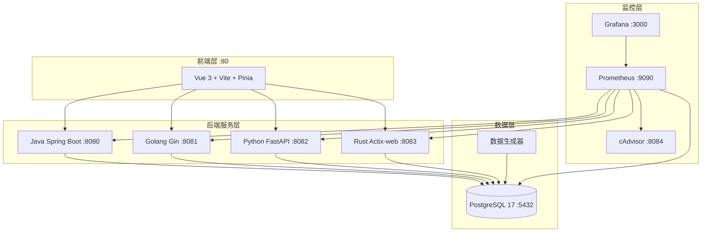

# 百万级数据导出跨语言性能基准测试系统

对比 Java、Golang、Python、Rust 四种语言在百万级数据导出场景下的性能表现。

## 系统架构



## 技术栈

| 语言 | 框架 | ORM/DB驱动 | 连接池 | Excel | 验证状态 |
|------|------|-----------|--------|-------|---------|
| **Java** | Spring Boot 3.2 / Gradle 8.12 | JOOQ | HikariCP | Apache POI SXSSF | ✅ 通过 |
| **Golang** | Gin / Go latest | GORM/pgx | pgxpool | excelize | ✅ 通过 |
| **Python** | FastAPI / Gunicorn | Tortoise ORM/asyncpg | asyncpg | openpyxl | ✅ 通过 |
| **Rust** | Actix-web / Cargo latest | Diesel | r2d2 | xlsxwriter | ⚠️ 编译阻塞 |
| **前端** | Vue 3 + Vite + Pinia | - | - | Nginx | 待验证 |
| **数据库** | PostgreSQL 17 | - | - | - | ✅ 通过 |

## 快速开始

### 前置要求

- Docker Engine 20.10+ / Docker Compose 2.0+
- 内存 ≥ 8GB（推荐 16GB）
- 磁盘 ≥ 20GB 可用空间

### 分步启动（推荐验证流程）

```bash
cd benchmark-IO

# 1. 复制环境变量配置
cp .env.example .env

# 2. 启动数据库
docker compose up -d postgres

# 3. 生成测试数据（默认 2000 万条，可加 --total 调整）
docker compose build data-generator
docker compose run --rm data-generator python main.py generate --total 10000

# 4. 逐一构建并验证后端服务
docker compose build java-api && docker compose up -d java-api
curl http://localhost:8080/actuator/health          # {"status":"UP"}
docker compose stop java-api                          # 验证后关闭释放内存

docker compose build golang-api && docker compose up -d golang-api
curl http://localhost:8081/health                     # {"service":"golang-api","status":"ok"}
docker compose stop golang-api

docker compose build python-api && docker compose up -d python-api
curl http://localhost:8082/health                     # {"status":"healthy",...}
docker compose stop python-api

# 5. 构建并启动前端（需至少一个后端运行中）
docker compose build frontend && docker compose up -d frontend
curl http://localhost                               # Vue.js 页面

# 6. 全部完成，清理
docker compose down
```

### 一键启动（跳过逐步验证）

```bash
# 使用默认配置启动全部服务
docker compose up -d

# 查看所有服务状态
docker compose ps
```

### 服务访问地址

| 服务 | 地址 | 说明 |
|------|------|------|
| 前端 | http://localhost | Vue.js 界面 |
| Java API | http://localhost:8080 | Spring Boot |
| Golang API | http://localhost:8081 | Gin |
| Python API | http://localhost:8082 | FastAPI |
| Rust API | http://localhost:8083 | Actix-web |
| Grafana | http://localhost:3000 | admin/admin123 |
| Prometheus | http://localhost:9090 | 指标查询 |

**API Key**: `benchmark-api-key-2024`（Header: `X-API-Key`）

## 核心接口

### 认证

所有请求需携带：`X-API-Key: benchmark-api-key-2024`

### 接口列表

| 方法 | 路径 | 说明 |
|------|------|------|
| GET | `/api/v1/orders?page=1&size=20` | 订单分页查询 |
| POST | `/api/v1/exports/sync` | 同步导出 (CSV/Excel) |
| POST | `/api/v1/exports/async` | 异步导出任务 |
| GET | `/api/v1/exports/tasks/{id}` | 任务状态查询 |
| GET | `/api/v1/exports/sse/{id}` | SSE 进度推送 |
| GET | `/api/v1/exports/download/{token}` | 文件下载 |
| POST | `/api/v1/exports/stream` | 流式导出 |

详细文档见 [docs/api.md](docs/api.md)

## 项目结构

```
benchmark-IO/
├── java/                    # ✅ Java 后端 (Spring Boot)
│   ├── src/main/java/com/benchmark/
│   │   ├── config/          # 数据库、异步、Web 配置
│   │   ├── controller/      # Export, Order 控制器
│   │   ├── middleware/       # API Key 认证
│   │   ├── model/           # Order, Task, Export 模型
│   │   ├── repository/      # JOOQ 数据访问层
│   │   ├── service/         # 业务逻辑（导出、订单、异步任务）
│   │   └── util/            # CSV/Excel 写入工具
│   └── Dockerfile
├── golang/                  # ✅ Golang 后端 (Gin)
│   ├── cmd/main.go          # 入口
│   ├── internal/
│   │   ├── config/          # 配置加载
│   │   ├── controller/      # 控制器
│   │   ├── middleware/       # 认证中间件
│   │   ├── model/           # 数据模型
│   │   ├── repository/      # GORM 数据访问
│   │   ├── service/         # 业务逻辑
│   │   └── util/            # CSV/Excel 工具
│   └── Dockerfile
├── python/                  # ✅ Python 后端 (FastAPI)
│   ├── app/
│   │   ├── main.py          # 应用入口
│   │   ├── config.py        # 配置
│   │   ├── models/          # Tortoise 模型
│   │   ├── api/             # 路由
│   │   ├── middleware/       # 认证中间件
│   │   ├── services/        # 业务逻辑
│   │   └── utils/           # 导出工具
│   ├── gunicorn.conf.py
│   └── Dockerfile
├── rust/                    # ⚠️ Rust 后端 (Actix-web)
│   ├── src/
│   │   ├── main.rs          # 入口
│   │   ├── models/          # Diesel 模型
│   │   ├── handlers/        # 请求处理器
│   │   ├── utils/           # Excel 工具
│   │   └── db.rs            # 数据库连接
│   ├── .cargo/config.toml   # Cargo 国内镜像
│   └── Dockerfile
├── frontend/                # Vue.js 前端
│   ├── src/
│   │   ├── views/           # Orders, Tasks 页面
│   │   ├── components/      # UI 组件
│   │   ├── api/             # API 调用
│   │   ├── stores/          # Pinia 状态管理
│   │   └── utils/           # 请求/SSE 工具
│   └── Dockerfile
├── postgres/                # PostgreSQL 17 配置
│   ├── postgresql.conf      # 性能优化配置
│   └── pg_hba.conf         # 访问控制
├── init/
│   ├── init.sql             # 数据库初始化脚本（30 字段 orders 表）
│   └── generate_data/       # Python 数据生成工具
├── docker-compose.yml       # Docker Compose 编排
├── .env.example             # 环境变量模板
└── docs/                    # 项目文档
```

## 已知问题与解决方案

### PostgreSQL 17 兼容性
- **问题**: `stats_temp_directory` 参数在 PostgreSQL 17 中已移除
- **解决**: 已注释掉 [postgres/postgresql.conf](postgres/postgresql.conf) 中的该配置

### Java JDK 21 Record 冲突
- **问题**: `java.lang.Record` 与 JOOQ 的 `org.jooq.Record` 类型歧义
- **解决**: OrderRepository.java 改为显式导入 `org.jooq.*` 相关类

### Java 时间/数值类型转换
- **问题**: JDBC 返回 `java.sql.Timestamp`/`Short`，代码期望 `LocalDateTime`/`Integer`
- **解决**: 添加 `toLocalDateTime()` 和 `toInt()` 类型转换方法

### Go 代理超时
- **问题**: `proxy.golang.org` 在国内不可达
- **解决**: Dockerfile 设置 `GOPROXY=https://goproxy.io,direct`

### Python Tortoise ORM 配置
- **问题**: `minsize`/`maxsize` 参数不支持；`generate_schemas()` 与已有表冲突
- **解决**: 移除连接池参数，注释自动建表（使用 init.sql）

### Rust xlsxwriter API 变更
- **问题**: xlsxwriter 0.6.x 的 Format/Worksheet API 发生重大变更（19 个编译错误）
- **状态**: 待修复，需要适配新版本的 builder pattern API

### Docker 镜像源问题
- **问题**: 部分镜像在 Apple Silicon (arm64) 上不可用或下载失败
- **解决**: alpine 基础镜像改为完整版；apt-get/pip/cargo 添加国内镜像和重试机制

## 配置说明

所有配置通过 `.env` 文件管理：

```bash
# 复制模板
cp .env.example .env

# 按需修改
vim .env
```

主要配置分类：
- **数据库**: `POSTGRES_*`, `DB_*`
- **认证**: `API_KEY`, `API_KEYS`
- **端口**: `*_PORT`, `PORT`, `SERVER_PORT`
- **运行时**: `JAVA_OPTS`, `PYTHON_WORKERS`, `GIN_MODE`, `RUST_LOG`
- **监控**: `GRAFANA_*`, `PROMETHEUS_*`

## 性能测试

```bash
cd benchmark/scripts

# 快速测试
./run_all.sh quick

# 完整测试套件
./run_all.sh full

# 收集结果
./collect_results.sh all
```

详细指南见 [docs/testing.md](docs/testing.md)、[docs/deploy.md](docs/deploy.md)

## 许可证

MIT License
