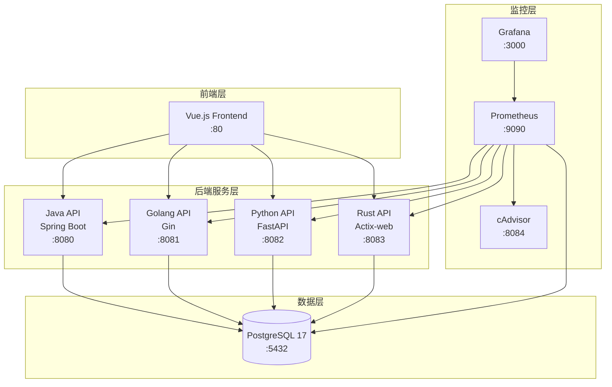

# 百万级数据导出跨语言性能基准测试系统

一个用于对比 Java、Golang、Python、Rust 四种语言在百万级数据导出场景下性能表现的基准测试系统。

## 项目概述

本系统旨在为技术选型提供客观的性能数据支撑，通过统一的测试场景和标准化的测试方法，对比不同编程语言在处理大规模数据导出时的性能差异。

### 核心特性

- **多语言支持**: Java (Spring Boot)、Golang (Gin)、Python (FastAPI)、Rust (Actix-web)
- **多种导出模式**: 同步导出、异步导出、流式导出
- **多格式支持**: CSV、Excel (XLSX)
- **百万级数据**: 支持最高 2000 万条记录的导出测试
- **完整监控**: Prometheus + Grafana + cAdvisor 实时监控
- **可视化界面**: Vue.js 前端，实时查看测试进度和结果

## 系统架构



## 技术栈

### 后端服务

| 语言 | 框架 | 数据库访问 | 连接池 | Excel 处理 |
|------|------|-----------|--------|-----------|
| Java | Spring Boot 3.2 | JOOQ | HikariCP | Apache POI (SXSSF) |
| Golang | Gin | pgx | pgxpool | excelize |
| Python | FastAPI | asyncpg | asyncpg | openpyxl |
| Rust | Actix-web | Diesel | r2d2 | rust_xlsxwriter |

### 前端 & 监控

- **前端**: Vue 3 + Vite + Pinia + Axios
- **数据库**: PostgreSQL 17
- **监控**: Prometheus + Grafana + cAdvisor
- **容器化**: Docker + Docker Compose

## 快速开始

### 前置要求

- Docker 20.10+
- Docker Compose 2.0+
- 内存: 至少 8GB (推荐 16GB)
- 磁盘: 至少 20GB 可用空间

### 一键启动

```bash
# 克隆项目
git clone <repository-url>
cd benchmark-IO

# 启动所有服务
./scripts/start.sh start

# 生成测试数据（首次运行）
./scripts/start.sh generate-data 2000000
```

### 访问服务

| 服务 | 地址 | 说明 |
|------|------|------|
| 前端界面 | http://localhost | Vue.js 前端 |
| Java API | http://localhost:8080 | Spring Boot 服务 |
| Golang API | http://localhost:8081 | Gin 服务 |
| Python API | http://localhost:8082 | FastAPI 服务 |
| Rust API | http://localhost:8083 | Actix-web 服务 |
| Grafana | http://localhost:3000 | 监控面板 (admin/admin123) |
| Prometheus | http://localhost:9090 | 指标查询 |
| cAdvisor | http://localhost:8084 | 容器监控 |

**API Key**: `benchmark-api-key-2024`

## API 接口

### 认证方式

所有 API 请求需要在 Header 中携带 API Key:

```http
X-API-Key: benchmark-api-key-2024
```

### 核心接口

#### 1. 订单查询

```http
GET /api/v1/orders?page=1&pageSize=20
```

#### 2. 同步导出

```http
POST /api/v1/exports/sync
Content-Type: application/json

{
  "format": "csv",
  "limit": 100000,
  "conditions": {
    "startTime": "2024-01-01",
    "endTime": "2024-12-31"
  }
}
```

#### 3. 异步导出

```http
POST /api/v1/exports/async
Content-Type: application/json

{
  "format": "xlsx",
  "limit": 1000000
}
```

#### 4. 任务状态查询

```http
GET /api/v1/exports/tasks/{task_id}
```

#### 5. SSE 进度推送

```http
GET /api/v1/exports/sse/{task_id}
Accept: text/event-stream
```

#### 6. 文件下载

```http
GET /api/v1/exports/download/{token}
```

#### 7. 流式导出

```http
POST /api/v1/exports/stream
Content-Type: application/json

{
  "format": "csv",
  "limit": 1000000
}
```

详细 API 文档请参考 [API 接口文档](docs/api.md)。

## 性能测试

### 测试场景

1. **查询性能测试**: 测试不同并发级别下的查询 QPS 和延迟
2. **同步导出测试**: 测试不同数据量下的导出时间
3. **异步导出测试**: 测试异步任务处理能力和内存占用
4. **流式导出测试**: 测试流式传输的性能表现

### 运行测试

```bash
# 进入测试目录
cd benchmark/scripts

# 运行快速测试
./run_all.sh quick

# 运行完整测试套件
./run_all.sh full

# 收集测试结果
./collect_results.sh all
```

详细测试指南请参考 [测试指南](docs/testing.md)。

## 项目结构

```
benchmark-IO/
├── java/                    # Java 后端服务
│   ├── src/                # 源代码
│   ├── build.gradle        # Gradle 配置
│   └── Dockerfile          # Docker 构建文件
├── golang/                  # Golang 后端服务
│   ├── cmd/                # 入口程序
│   ├── internal/           # 内部代码
│   └── Dockerfile
├── python/                  # Python 后端服务
│   ├── app/                # 应用代码
│   ├── requirements.txt    # 依赖列表
│   └── Dockerfile
├── rust/                    # Rust 后端服务
│   ├── src/                # 源代码
│   ├── Cargo.toml          # Cargo 配置
│   └── Dockerfile
├── frontend/                # Vue.js 前端
│   ├── src/                # 源代码
│   ├── package.json        # NPM 配置
│   └── Dockerfile
├── postgres/                # PostgreSQL 配置
│   ├── postgresql.conf     # 数据库配置
│   └── pg_hba.conf         # 访问控制
├── monitor/                 # 监控配置
│   ├── prometheus.yml      # Prometheus 配置
│   ├── dashboards/         # Grafana Dashboard
│   └── datasources/        # 数据源配置
├── init/                    # 初始化脚本
│   ├── init.sql            # 数据库初始化
│   └── generate_data/      # 数据生成工具
├── benchmark/               # 性能测试脚本
│   ├── scripts/            # wrk 测试脚本
│   └── results/            # 测试结果
├── scripts/                 # 运维脚本
│   └── start.sh            # 一键启动脚本
├── docs/                    # 文档
│   ├── deploy.md           # 部署文档
│   ├── api.md              # API 文档
│   └── testing.md          # 测试指南
├── docker-compose.yml       # Docker Compose 配置
├── .env.example             # 环境变量模板
└── README.md                # 本文档
```

## 部署指南

### 开发环境

```bash
# 使用默认配置启动
./scripts/start.sh start

# 查看服务状态
./scripts/start.sh status

# 查看日志
./scripts/start.sh logs -f java-api
```

### 生产环境

生产环境部署请参考 [部署文档](docs/deploy.md)，包括：

- 环境变量配置
- 资源限制调整
- 数据持久化
- 安全加固
- 高可用配置

## 监控指标

### 关键指标

- **应用性能**: QPS、响应时间 (P50/P95/P99)、错误率
- **资源使用**: CPU、内存、磁盘 I/O、网络 I/O
- **数据库**: 连接数、查询性能、事务数
- **导出性能**: 导出速度、内存占用、文件大小

### Grafana Dashboard

系统预置了 Benchmark 监控面板，提供：

- 多语言服务性能对比
- 实时资源监控
- 数据库性能指标
- 导出任务统计

## 性能优化建议

### Java

- 使用 HikariCP 连接池，合理配置连接数
- Excel 导出使用 SXSSF 流式 API
- 调整 JVM 堆内存和 GC 策略

### Golang

- 使用 pgxpool 连接池
- 控制并发 goroutine 数量
- 使用 buffer 减少 I/O 操作

### Python

- 使用 asyncpg 异步数据库驱动
- 配置合理的 Gunicorn workers 数量
- 使用流式响应避免内存溢出

### Rust

- 使用 Diesel ORM 和连接池
- 利用 Rust 的零成本抽象
- 合理配置 actix-web worker 数量

## 常见问题

### 1. 服务启动失败

检查端口是否被占用：
```bash
lsof -i :8080
lsof -i :5432
```

### 2. 数据库连接失败

确保 PostgreSQL 已启动：
```bash
docker compose ps postgres
docker compose logs postgres
```

### 3. 内存不足

调整 Docker 内存限制或减少并发数：
```bash
# 修改 .env 文件
JAVA_OPTS=-Xms256m -Xmx512m
```

### 4. 导出速度慢

- 检查数据库索引是否正确
- 调整数据库连接池大小
- 使用流式导出替代同步导出

## 贡献指南

欢迎提交 Issue 和 Pull Request。

## 许可证

MIT License

## 联系方式

如有问题，请提交 Issue 或联系维护团队。
