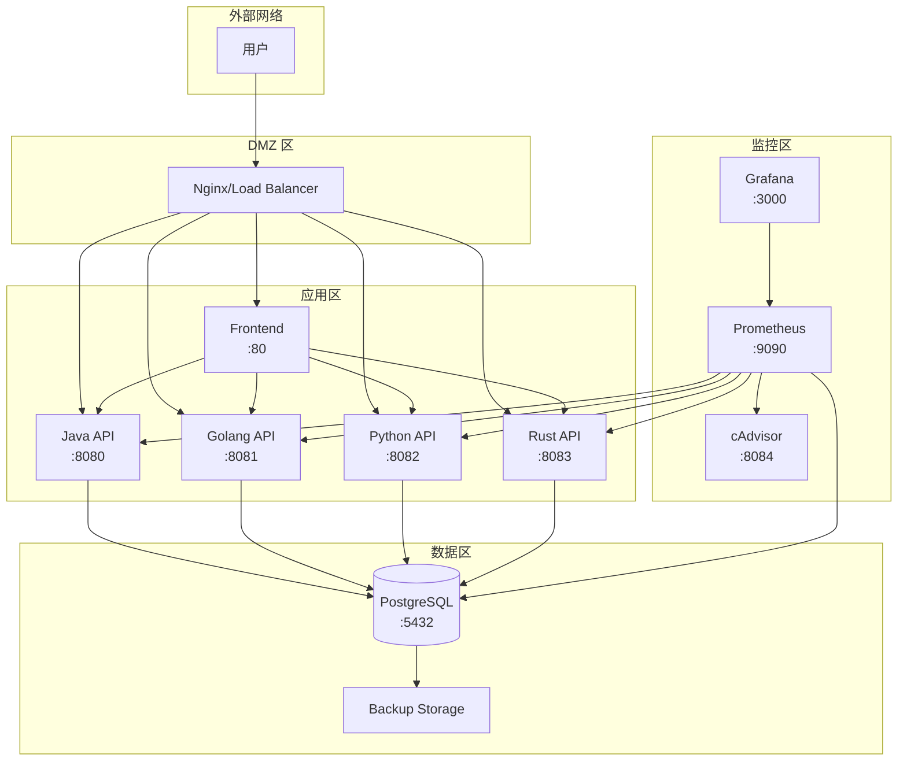

# 部署文档

本文档详细说明百万级数据导出跨语言性能基准测试系统的部署流程，包括开发环境、测试环境和生产环境的部署方案。

## 目录

- [系统要求](#系统要求)
- [部署架构](#部署架构)
- [环境配置](#环境配置)
- [快速部署](#快速部署)
- [生产环境部署](#生产环境部署)
- [数据持久化](#数据持久化)
- [安全配置](#安全配置)
- [监控配置](#监控配置)
- [故障排查](#故障排查)

## 系统要求

### 硬件要求

| 环境 | CPU | 内存 | 磁盘 | 网络 |
|------|-----|------|------|------|
| 开发环境 | 4 核 | 8 GB | 50 GB | 100 Mbps |
| 测试环境 | 8 核 | 16 GB | 100 GB | 1 Gbps |
| 生产环境 | 16 核+ | 32 GB+ | 500 GB+ SSD | 10 Gbps |

### 软件要求

| 软件 | 版本要求 | 说明 |
|------|---------|------|
| Docker | 20.10+ | 容器运行时 |
| Docker Compose | 2.0+ | 容器编排工具 |
| Git | 2.0+ | 版本控制 |

### 操作系统支持

- Ubuntu 20.04/22.04 LTS
- CentOS 7/8
- macOS 11+
- Windows 10/11 (with WSL2)

## 部署架构

### 网络架构



### 网络隔离

系统采用三层网络隔离架构：

- **frontend 网络** (172.28.0.0/16): 前端和后端服务通信
- **backend 网络** (172.29.0.0/16): 后端服务和数据库通信
- **monitor 网络** (172.30.0.0/16): 监控服务通信

## 环境配置

### 1. 克隆项目

```bash
git clone <repository-url>
cd benchmark-IO
```

### 2. 配置环境变量

```bash
# 复制环境变量模板
cp .env.example .env

# 编辑环境变量
vim .env
```

### 环境变量说明

#### 数据库配置

```bash
# PostgreSQL 配置
POSTGRES_USER=benchmark              # 数据库用户名
POSTGRES_PASSWORD=benchmark123       # 数据库密码（生产环境请使用强密码）
POSTGRES_DB=benchmark                # 数据库名称
POSTGRES_PORT=5432                   # 数据库端口
```

#### API 认证配置

```bash
# API Key 认证
API_KEY=benchmark-api-key-2024       # API 密钥（生产环境请修改）
```

#### 服务端口配置

```bash
# 后端服务端口
JAVA_PORT=8080
GOLANG_PORT=8081
PYTHON_PORT=8082
RUST_PORT=8083

# 前端端口
FRONTEND_PORT=80

# 监控服务端口
PROMETHEUS_PORT=9090
GRAFANA_PORT=3000
CADVISOR_PORT=8084
POSTGRES_EXPORTER_PORT=9187
```

#### 运行时配置

```bash
# Java JVM 配置
JAVA_OPTS=-Xms512m -Xmx1024m

# Python Workers
PYTHON_WORKERS=4

# Rust 日志级别
RUST_LOG=info

# Golang Gin 模式
GIN_MODE=release
```

## 快速部署

### 开发环境

```bash
# 一键启动所有服务
./scripts/start.sh start

# 生成测试数据（200万条）
./scripts/start.sh generate-data 2000000

# 查看服务状态
./scripts/start.sh status
```

### 测试环境

```bash
# 构建镜像
./scripts/start.sh build

# 启动服务
./scripts/start.sh start

# 查看日志
./scripts/start.sh logs -f
```

## 生产环境部署

### 1. 安全配置

#### 1.1 修改默认密码

```bash
# 生成强密码
POSTGRES_PASSWORD=$(openssl rand -base64 32)
API_KEY=$(openssl rand -hex 32)
GRAFANA_ADMIN_PASSWORD=$(openssl rand -base64 24)

# 更新 .env 文件
sed -i "s/^POSTGRES_PASSWORD=.*/POSTGRES_PASSWORD=$POSTGRES_PASSWORD/" .env
sed -i "s/^API_KEY=.*/API_KEY=$API_KEY/" .env
sed -i "s/^GRAFANA_ADMIN_PASSWORD=.*/GRAFANA_ADMIN_PASSWORD=$GRAFANA_ADMIN_PASSWORD/" .env
```

#### 1.2 配置防火墙

```bash
# Ubuntu UFW
sudo ufw allow 80/tcp
sudo ufw allow 443/tcp
sudo ufw enable

# CentOS Firewalld
sudo firewall-cmd --permanent --add-port=80/tcp
sudo firewall-cmd --permanent --add-port=443/tcp
sudo firewall-cmd --reload
```

#### 1.3 配置 HTTPS

使用 Nginx 反向代理并配置 SSL：

```nginx
# /etc/nginx/sites-available/benchmark
server {
    listen 80;
    server_name benchmark.example.com;
    return 301 https://$server_name$request_uri;
}

server {
    listen 443 ssl http2;
    server_name benchmark.example.com;

    ssl_certificate /etc/letsencrypt/live/benchmark.example.com/fullchain.pem;
    ssl_certificate_key /etc/letsencrypt/live/benchmark.example.com/privkey.pem;

    # 前端
    location / {
        proxy_pass http://localhost:80;
        proxy_set_header Host $host;
        proxy_set_header X-Real-IP $remote_addr;
    }

    # API 服务
    location /api/ {
        proxy_pass http://localhost:8080;
        proxy_set_header Host $host;
        proxy_set_header X-Real-IP $remote_addr;
        proxy_set_header X-Forwarded-For $proxy_add_x_forwarded_for;
        proxy_set_header X-Forwarded-Proto $scheme;
    }

    # Grafana
    location /grafana/ {
        proxy_pass http://localhost:3000/;
        proxy_set_header Host $host;
    }
}
```

### 2. 资源配置

#### 2.1 调整内存限制

编辑 `docker-compose.yml`，根据服务器配置调整资源限制：

```yaml
services:
  java-api:
    deploy:
      resources:
        limits:
          memory: 2G
        reservations:
          memory: 1G
```

#### 2.2 数据库优化

编辑 `postgres/postgresql.conf`：

```ini
# 内存配置
shared_buffers = 2GB
effective_cache_size = 6GB
work_mem = 64MB
maintenance_work_mem = 512MB

# 连接配置
max_connections = 200

# WAL 配置
wal_buffers = 64MB
checkpoint_completion_target = 0.9
```

### 3. 高可用配置

#### 3.1 数据库主从复制

```yaml
# docker-compose.ha.yml
services:
  postgres-master:
    image: postgres:17-alpine
    environment:
      POSTGRES_USER: ${POSTGRES_USER}
      POSTGRES_PASSWORD: ${POSTGRES_PASSWORD}
      POSTGRES_DB: ${POSTGRES_DB}
    volumes:
      - postgres_master_data:/var/lib/postgresql/data
    command: |
      postgres
      -c wal_level=replica
      -c max_wal_senders=3
      -c wal_keep_segments=64

  postgres-slave:
    image: postgres:17-alpine
    environment:
      POSTGRES_USER: ${POSTGRES_USER}
      POSTGRES_PASSWORD: ${POSTGRES_PASSWORD}
      PGUSER: replicator
      PGPASSWORD: ${REPLICATION_PASSWORD}
    depends_on:
      - postgres-master
    command: |
      bash -c "until pg_basebackup -h postgres-master -D /var/lib/postgresql/data -U replicator -Fp -Xs -P -R; do sleep 1; done && postgres"
```

#### 3.2 负载均衡

使用 Nginx 或 HAProxy 对后端服务进行负载均衡：

```nginx
upstream backend_apis {
    least_conn;
    server localhost:8080 weight=3;
    server localhost:8081 weight=3;
    server localhost:8082 weight=2;
    server localhost:8083 weight=2;
}

server {
    location /api/ {
        proxy_pass http://backend_apis;
        proxy_set_header Host $host;
        proxy_set_header X-Real-IP $remote_addr;
    }
}
```

## 数据持久化

### 数据卷说明

| 卷名 | 用途 | 挂载点 |
|------|------|--------|
| postgres_data | 数据库数据 | /var/lib/postgresql/data |
| postgres_backup | 数据库备份 | /backup |
| prometheus_data | 监控数据 | /prometheus |
| grafana_data | Grafana 数据 | /var/lib/grafana |
| export_temp | 导出临时文件 | /tmp/exports |

### 数据备份

#### 数据库备份

```bash
# 手动备份
docker compose exec postgres pg_dump -U benchmark benchmark > backup_$(date +%Y%m%d).sql

# 自动备份脚本
cat > /etc/cron.daily/backup-benchmark << 'EOF'
#!/bin/bash
BACKUP_DIR=/backup/postgres
mkdir -p $BACKUP_DIR
docker compose exec -T postgres pg_dump -U benchmark benchmark | gzip > $BACKUP_DIR/benchmark_$(date +%Y%m%d_%H%M%S).sql.gz
find $BACKUP_DIR -name "*.sql.gz" -mtime +7 -delete
EOF
chmod +x /etc/cron.daily/backup-benchmark
```

#### 数据恢复

```bash
# 恢复数据库
gunzip -c backup_20240101.sql.gz | docker compose exec -T postgres psql -U benchmark benchmark
```

## 安全配置

### 1. 网络安全

- 使用防火墙限制端口访问
- 仅暴露必要的服务端口
- 使用 VPN 或 SSH 隧道访问管理端口

### 2. 应用安全

- 定期更新基础镜像
- 使用非 root 用户运行容器
- 限制容器权限

### 3. 数据安全

- 数据库密码加密存储
- 定期备份数据
- 敏感数据传输使用 TLS

## 监控配置

### Prometheus 告警规则

创建 `monitor/alert.rules.yml`：

```yaml
groups:
  - name: benchmark_alerts
    rules:
      - alert: HighErrorRate
        expr: rate(http_requests_total{status=~"5.."}[5m]) > 0.05
        for: 5m
        labels:
          severity: warning
        annotations:
          summary: "High error rate detected"
          description: "Error rate is {{ $value }} requests/s"

      - alert: HighMemoryUsage
        expr: container_memory_usage_bytes{name=~"benchmark-.*"} / 1024 / 1024 > 1500
        for: 5m
        labels:
          severity: warning
        annotations:
          summary: "High memory usage"
          description: "Container {{ $labels.name }} is using {{ $value }}MB"

      - alert: DatabaseConnectionsHigh
        expr: pg_stat_activity_count > 150
        for: 5m
        labels:
          severity: warning
        annotations:
          summary: "High database connections"
          description: "PostgreSQL has {{ $value }} active connections"
```

### Grafana Dashboard

系统预置了 Benchmark 监控面板，包含：

- 服务健康状态
- 请求 QPS 和延迟
- 资源使用情况
- 数据库性能指标

## 故障排查

### 常见问题

#### 1. 服务无法启动

```bash
# 检查日志
docker compose logs java-api
docker compose logs postgres

# 检查端口占用
netstat -tlnp | grep 8080

# 检查容器状态
docker compose ps
```

#### 2. 数据库连接失败

```bash
# 检查数据库状态
docker compose exec postgres pg_isready

# 检查连接数
docker compose exec postgres psql -U benchmark -c "SELECT count(*) FROM pg_stat_activity;"

# 检查网络
docker compose exec java-api ping postgres
```

#### 3. 内存不足

```bash
# 查看容器资源使用
docker stats

# 调整内存限制
# 编辑 docker-compose.yml 中的 deploy.resources
```

#### 4. 磁盘空间不足

```bash
# 清理未使用的镜像和容器
docker system prune -a

# 清理旧数据
docker volume prune
```

### 日志查看

```bash
# 查看所有服务日志
docker compose logs -f

# 查看特定服务日志
docker compose logs -f java-api

# 查看最近 100 行日志
docker compose logs --tail=100 java-api
```

### 健康检查

```bash
# 检查服务健康状态
curl http://localhost:8080/actuator/health
curl http://localhost:8081/health
curl http://localhost:8082/health
curl http://localhost:8083/health

# 检查数据库
docker compose exec postgres pg_isready -U benchmark
```

## 升级指南

### 1. 备份数据

```bash
# 备份数据库
docker compose exec postgres pg_dump -U benchmark benchmark > backup_before_upgrade.sql

# 备份配置
cp .env .env.backup
```

### 2. 拉取最新代码

```bash
git pull origin main
```

### 3. 重新构建镜像

```bash
./scripts/start.sh build --no-cache
```

### 4. 重启服务

```bash
./scripts/start.sh restart
```

## 附录

### Docker Compose 常用命令

```bash
# 启动服务
docker compose up -d

# 停止服务
docker compose down

# 重启服务
docker compose restart

# 查看日志
docker compose logs -f

# 进入容器
docker compose exec java-api bash

# 查看资源使用
docker compose top
```

### 性能调优参数

| 参数 | 默认值 | 推荐值 | 说明 |
|------|--------|--------|------|
| JAVA_OPTS | -Xms512m -Xmx1024m | -Xms1g -Xmx2g | Java 堆内存 |
| PYTHON_WORKERS | 4 | CPU 核心数 * 2 + 1 | Python 工作进程数 |
| POSTGRES_MAX_CONNECTIONS | 200 | 200-500 | 数据库最大连接数 |
| PROMETHEUS_RETENTION | 30d | 30d-90d | 监控数据保留时间 |
